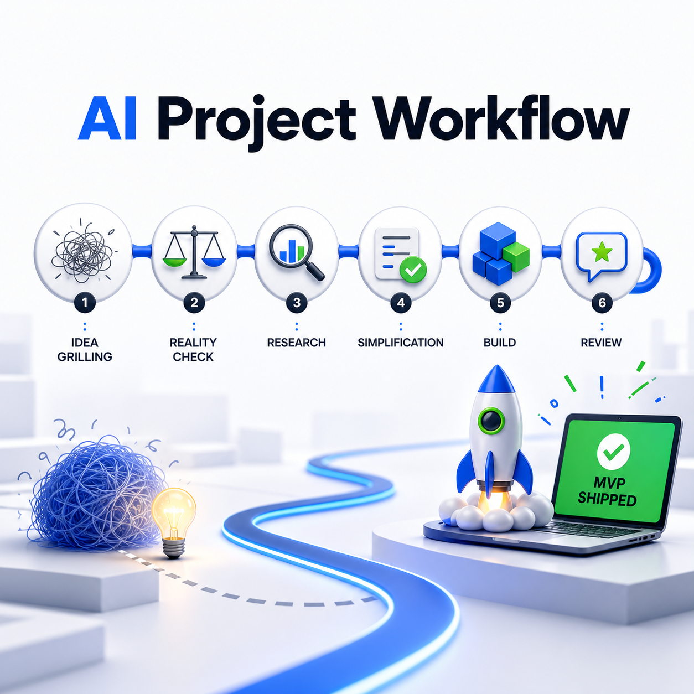

# AI Project Workflow · AI 项目开发工作流

把模糊想法变成可验证的软件：先明确问题，再研究、收缩 MVP、制作原型、分段实现与复盘。

**Codex Skill · 从想法到 MVP · 项目记忆 · 纵向切片 · 质量复核**

## 一句话介绍

这是一个给 Codex 使用的项目协作 Skill。它会按项目所处阶段提出关键问题，帮助你确认目标、验证需求、规划最小可用版本，并在实现后检查代码与需求是否吻合。

## 快速安装

```powershell
git clone https://github.com/9-GETOVER-9/ai-project-workflow.git
New-Item -ItemType Directory -Force "$env:USERPROFILE\.codex\skills" | Out-Null
Copy-Item -Recurse -Force .\ai-project-workflow "$env:USERPROFILE\.codex\skills\ai-project-workflow"
```

在 Codex 中输入 `$ai-project-workflow`，也可以附上想法或现有项目问题。

## 功能矩阵

| 阶段 | 作用 |
|---|---|
| 想法澄清 | 追问用户、问题与成功标准 |
| 现实研究 | 检查竞品、约束和快速变化的信息 |
| MVP 收缩 | 只保留能验证核心价值的功能 |
| 原型验证 | 对不确定的交互先做可讨论的原型 |
| 分段开发 | 按可验证的用户行为安排纵向切片 |
| 项目记忆 | 记录术语、问题追踪位置和关键决策 |
| 完成复核 | 同时检查代码质量与需求匹配 |

## 使用示例

```text
$ai-project-workflow 我想做一个 AI 笔记工具，先帮我确定 MVP。
```

## 核心工作流

```text
想法 → 关键问题 → 现实研究 → MVP → 原型 → 纵向切片 → 实现 → 复核
```

## 项目结构

| 路径 | 用途 |
|---|---|
| `SKILL.md` | Skill 入口与阶段规则 |
| `agents/openai.yaml` | Codex 展示信息 |
| `docs/BEHAVIOR_CHECKS.md` | 行为校验场景 |
| `assets/` | 项目展示素材 |

## 适用边界

新项目可走完整流程；明确的小改动和 Bug 修复可以按需缩短流程。已经确认的项目简报会从当前阶段继续。

## 详细说明

A Codex skill for building software with AI without letting the AI sprint into code too early.



It turns a vague project idea into a staged workflow:

0. Set up project memory when entering a real repo
1. Grill the idea
2. Check it against reality
3. Research comparable projects and fast-moving changes
4. Cut the plan down to the simplest useful MVP
5. Prototype the uncertain parts before locking the MVP
6. Plan the MVP as vertical slices
7. Build one slice at a time
8. Review both code quality and requirement fit before calling it done

## Why

AI coding often fails before the first line of code: unclear requirements, copied architecture, over-engineering, and late review.

This skill gives Codex a simple collaboration protocol so it knows when to ask, when to research, when to simplify, and when to build.

It also adds a prototype checkpoint when the user needs to see whether the product matches their intent before implementation hardens.

It can also establish lightweight project memory:

- `docs/agents/issue-tracker.md` for where work items live
- `CONTEXT.md` for shared project vocabulary
- `docs/adr/` for important architecture decisions

For larger MVPs, it prefers vertical slices over layer-only task lists, so each slice delivers one verifiable user behavior instead of only "database", "backend", or "frontend" work.

## Install

Copy this folder into your Codex skills directory:

```text
~/.codex/skills/ai-project-workflow
```

Then start a project with:

```text
$ai-project-workflow
```

## Workflow

For a new idea, the first substantive response identifies the current stage and
asks about the product decisions that are still missing. The agent waits for
those answers before implementing anything that depends on them. Choosing a
technology stack for you does not mean choosing the product's purpose for you.

For example:

```text
$ai-project-workflow I want to build an AI notes tool. Help me clarify the MVP.
```

Expect questions about who will use it and what AI should do with a real note.
After the answers, the agent summarizes the scope and acceptance criteria and
continues the authorized work. If you request a prototype to review first,
it presents a preview and waits for your feedback before production work.

An already confirmed brief or precise small edit can proceed directly. You
can also explicitly delegate choices:

```text
$ai-project-workflow Skip the interview. Choose the scope for a local todo demo.
```

In that case, the agent labels its assumptions and proceeds. Continuing a
project resumes its last confirmed stage instead of restarting the interview.

The skill does not force every stage every time. It chooses the lightest process that fits the project:

- New project: full workflow
- Small feature: compressed clarification and review
- Bug fix: narrow investigation, fix, verify

`$ai-project-workflow` remains the main entrypoint. Future stage-specific skills can be added underneath it without forcing the user to remember every helper name.

## Included Files

- `SKILL.md`: the actual Codex skill
- `agents/openai.yaml`: display metadata for Codex
- `docs/BEHAVIOR_CHECKS.md`: behavioral regression scenarios and validation notes

## License

MIT
